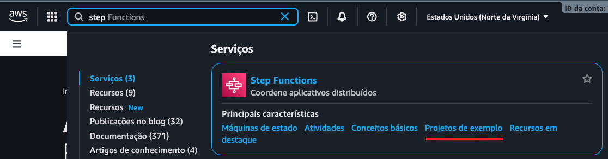
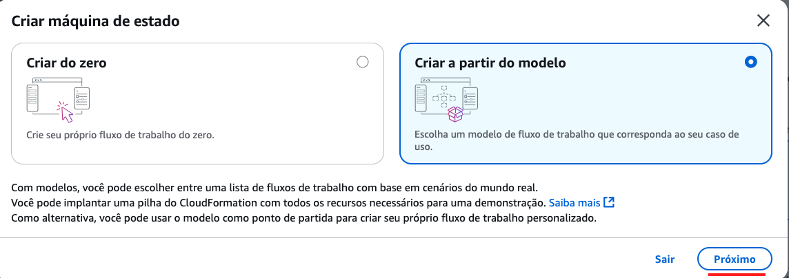
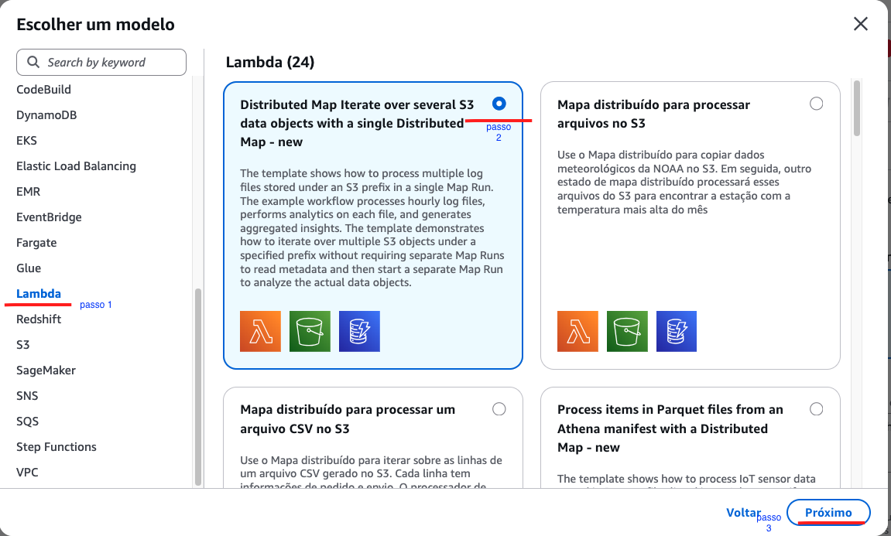
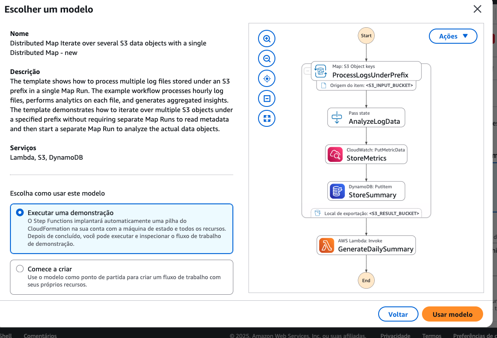
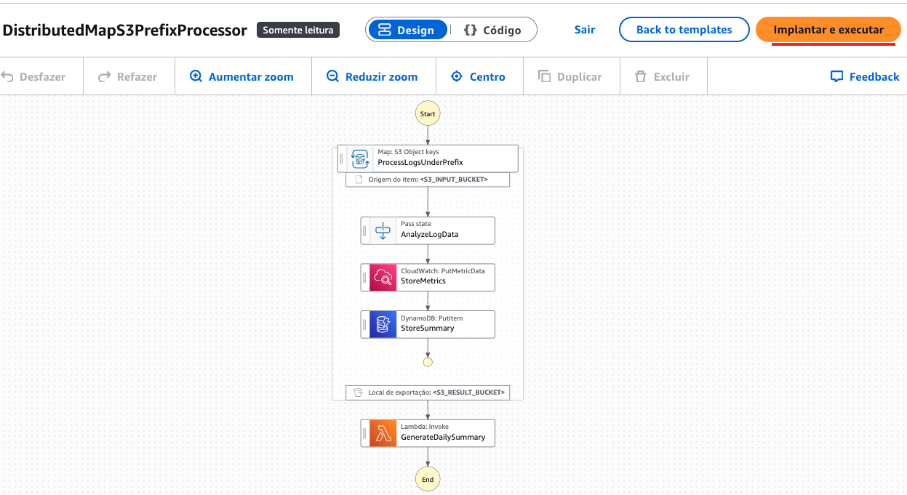
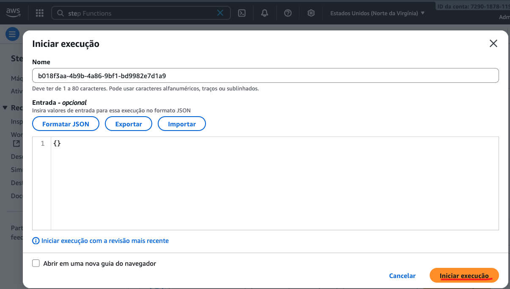
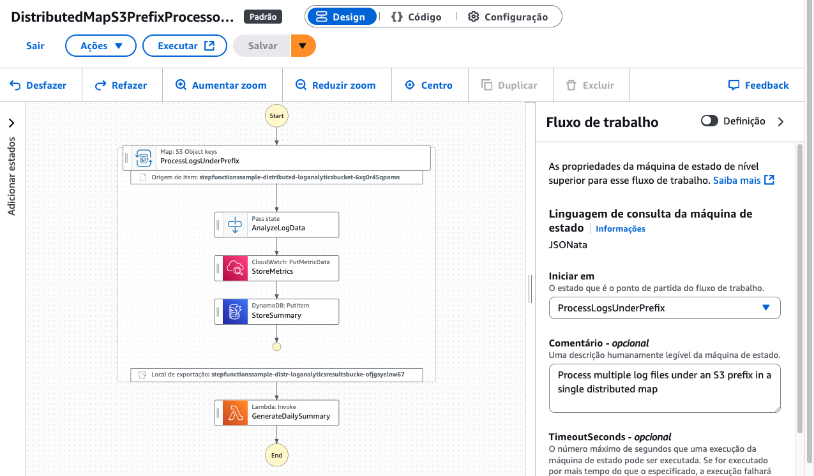
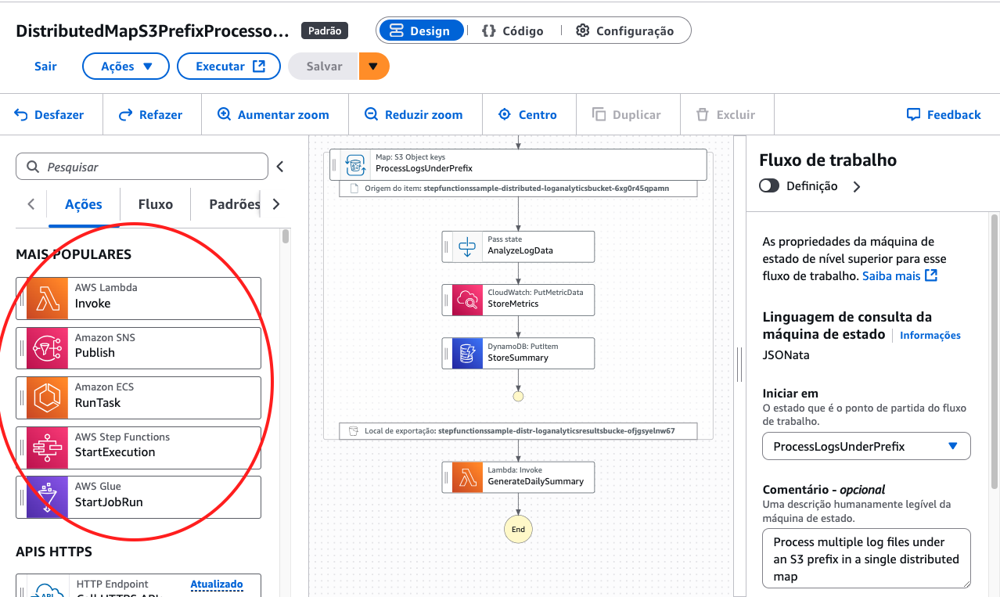
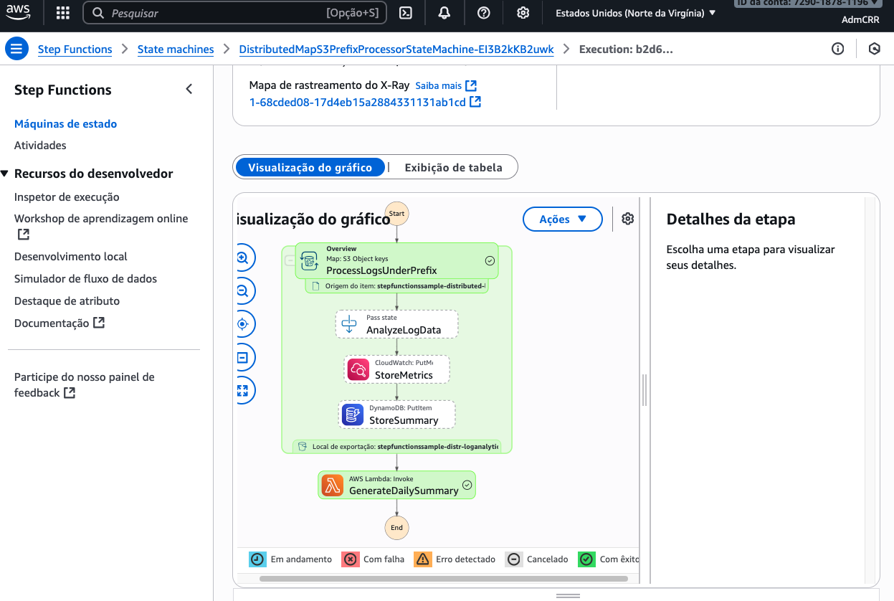

## Desafio: Orquestração de Workflows com AWS Step Functions 

### Laboratório - Bootcamp CodeGirls
---

### Objetivo:

Este laboratório tem como objetivo explorar o sistema **'Step Function'** da nuvem AWS  para entender na prática como uma Máquina de Estados é criada, implantada e executada. O foco é analisar um workflow simples que orquestra uma função AWS Lambda para consolidar os conceitos de estados, execução e visualização de fluxo.

---

### Visão Geral

De acordo com a definição aprendida em aula, **AWS Step Functions** nada mais é do que um construtor visual para criar fluxos de trabalho.
Um serviço que facilita a coordenação de aplicativos e microserviços, usando fluxos de trabalho visuais.

Ao criar o fluxo de trabalho, não precisamos ter todos os recursos da AWS antecipadamente para começar.

Podemos criar o workflow e depois adicionar as definições aos recursos. Mas também podemos ter todos os recursos da AWS implantados em nossa conta antes de começar a trabalhar e depois implantar os recursos necessários neste workflow que teremos.

No *Step Functions* é possível criar projetos usando a opção 'projetos de exemplo'. É um processo low code onde conseguimos criar workflows facilmente.

**Projeto de Exemplo Selecionado:** *Processamento Distribuído no S3*

Para este laboratório, foi utilizado o projeto de exemplo "Process prefixes in an Amazon S3 bucket with a distributed map".

Este workflow é projetado para processar um grande número de objetos em um bucket S3 de forma paralela e distribuída. Ele demonstra o uso do estado Map em modo distribuído, uma funcionalidade poderosa para tarefas de processamento de dados em larga escala.

A máquina de estados implantada por este modelo foi `DistributedMapS3PrefixProcessorStateMachine-EI3B2kKB2uwk.` 
A seguir veremos passo a passo como criar uma máquina usando a função *Projetos de Exemplo.*

---

### Passo a Passo:

**1. Em sua conta AWS procure por *Step Function* e clique em <ins>projetos de exemplo.**

**2. Em Em seguida escolha *criar a partir de modelo* e clique em <ins>próximo.**

**3. Escolha a função desejada, eu escolhi  *Lambda Function,* escolha o mapa desejado e clique em <ins>próximo.**

 **4. Clique em <ins>executar uma demonstração</ins>, e <ins>usar modelo.**

 **5. Em seguida clique em <ins>implantar e executar</ins>.**

 **6. Clique em <ins>iniciar execução</ins>.**

**7. Clique em <ins>executar</ins>.**

**8. Em seguida, podemos escolher ações como *invoke*, *publish,* *run task* etc.**

**9. Por fim podemos explorar a área de execução da máquina.**

---

### Aprendizados 

- Entendi na prática como funciona uma máquina de estados e como o Step Functions visualiza todo o fluxo de execução através de diagramas.

- Aprendi que posso criar workflows sem ter todos os recursos AWS prontos antecipadamente, o que dá flexibilidade no desenvolvimento.

- Os projetos de exemplo são muito úteis para iniciantes, permitindo partir de templates funcionais ao invés de começar do zero.

- Consegui acompanhar execuções em tempo real, vendo cada estado sendo processado e entendendo como workflows organizam processos complexos de forma visual.

---

### Conclusão

Este laboratório foi fundamental para o meu aprendizado sobre AWS Step Functions, permitindo criar e ver de primeira mão suas funcionalidades e o quão user-friendly o sistema é, até para iniciantes. Sua capacidade de modelar, executar e monitorar fluxos de trabalho complexos de forma low-code e escalável o torna um componente essencial na arquitetura de aplicações serverless modernas.